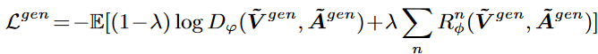
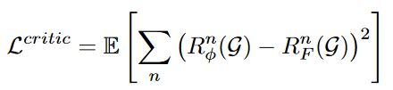

# Conditional-GraphGANFed: Optimizing Graph-Structured Molecule Generation in Federated Generative Adversarial Networks

In this project, we propose the conditonal GraphGANFed (cGraphGANFed) framework which is a novel extension of our original GraphGANFed [1]. cGraphGANFed integrates the critic network to evaluate the generated molecules using user-defined metric(s). The evaluation results from both the critic network and discriminator are integrated into the loss function of the generator, thus guiding it to generate novel molecules that maintain similar chemical properties to real ones while optimizing user-defined metrics.

The generator and discriminator architectures in cGraphGANFed are similar to that in GraphGANFed, however the loss function of the generator is different from that in GraphGAN. In cGraphGANFed, the generator's loss function is the weighted combination of the Wasserstein loss and predicted user-defined metric values as given below:

The critic network is also implemented as relational-GCN as the discriminator and predicts the metric values of the input molecule. The critic network is trained to minimize the MSE loss between the predicted and ground truth metric values, i.e., 

Extensive simulations are conducted to demonstrate the performance of cGraphGANFed under the following two scenarios, (a) optimization of a specific molecular metric, and (b) optimization of all molecular metrics simultaneously. 

The results show that cGraphGANFed can (a) produce molecules with significantly higher values of the specified molecular metric in comparison to other metrics, or (b) generate the molecules that exhibit high values across the majority of molecular metrics, which have dependent relationships (e.g., QED, Validity, and LogP).

The PDF to the paper can be found here:
[cGraphGANFed](Paper/cGraphGANFed.pdf)

[1] D. Manu, J. Yao, W. Liu and X. Sun, "GraphGANFed: A Federated Generative Framework for Graph-Structured Molecules Towards Efficient Drug Discovery," in IEEE/ACM Transactions on Computational Biology and Bioinformatics, vol. 21, no. 2, pp. 240-253, March-April 2024, doi: 10.1109/TCBB.2024.3349990.
